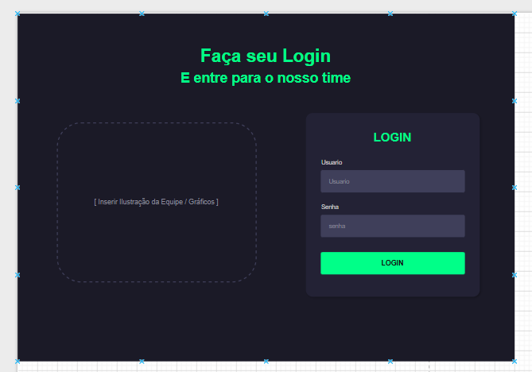
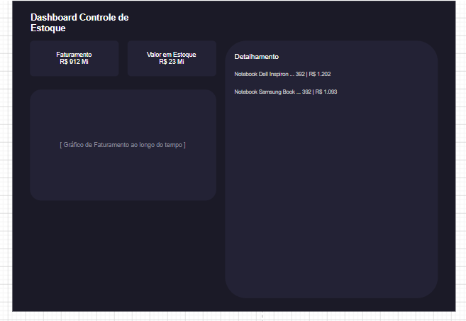
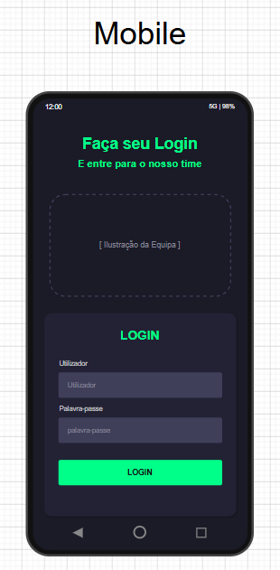

# Pré-Projeto — TechStock

## 1. Identificação da Equipe
* **Nome do Projeto:** TechStock
* **Integrantes:**

| Nome | GitHub | Responsabilidade |
| :--- | :--- | :--- |
| Thiago Rodrigues | [https://github.com/thiago-navo](https://github.com/thiago-navo) | Front-end (HTML, CSS, JS), lógica de interface e suporte responsivo |
| Mauricio Keiser | [https://github.com/mauriciokeiser](https://github.com/mauriciokeiser) | Back-end Core, Banco de Dados, lógica do sistema e CRUD básico |
| Pâmela Cristina R. Barbosa | [https://github.com/Pamela-Barbosa](https://github.com/Pamela-Barbosa) | Arquitetura MVC, Dashboard (API), lógica do sistema, Controle de Permissões, Diagramas e Gestão de Merges (Maintainer) |

## 2. Elevator Pitch
Uma aplicação funcional para pequenas empresas e setores de estoque de informática que precisam controlar seus produtos, o **TechStock** é uma aplicação web que permite cadastrar, atualizar, consultar, ver relatórios e gerenciar peças no estoque. Diferente de planilhas ou anotações manuais, o sistema centraliza as informações em um único lugar, trazendo agilidade, segurança e eficiência.

## 3. Público-Alvo e Contexto de Uso
* **Quem:** Encarregados ou gerentes de estoque, conferentes, recebedores, despachadores e operadores.
* **Situação:** Utilizado dentro de pequenos galpões, salas comerciais, empresas de informática e lojas de computadores.
* **Por que é melhor:** Centraliza informações, facilita a busca, reduz erros de atualização e mantém o estoque sempre atualizado em tempo real.

## 4. Funcionalidades Principais
1. **Cadastrar componentes:** Para controlar os produtos disponíveis.
2. **Pesquisar produtos:** Por nome ou categoria para encontrá-los rapidamente.
3. **Registrar movimentações:** Entradas e retiradas para manter o estoque atualizado.
4. **Gerenciar itens:** Editar ou excluir produtos cadastrados para corrigir informações.
5. **Dashboard e Relatórios:** Visualização do estoque atual e indicadores para acompanhamento.

## 5. Escopo Negativo
* Não terá sistema de vendas, emissão de notas fiscais ou controle financeiro complexo.
* Não terá pagamentos online, integração com marketplaces ou login com redes sociais.
* Não terá controle por código de barras nem notificações por e-mail.
* Não será um app mobile nativo (apenas Web responsiva).

## 6. Modelo de Dados Preliminar (SQLAlchemy/SQLite)
[![](https://mermaid.ink/img/pako:eNqtWFtv4jgU_itRpJF2pVINt0J5SyHtRgIyE2C1WiEhNzHgVWKnjlN1y_RpH-aH9Y-tEwiNzQlkZpeqSJyL_Z37SXamzwJsDkzMRwRtOIqWfEkN-fn0yWg0GoY9-eLZM8uwDXs6sj37_btr_HJnzexfM3YhvOcNXePbt0aD7Y5aA2Npyr8KqaE7nXvW3JrObV3yoP-jgvfWnecMa8i53tQe2iPXK8lplstL752HhWe9f3__x5UO-M2xPcv7unCssullbIX1BztX9mzufl3oWBazheU5F7yggfHssTV03Kk1sadzd2aMbOOL544Wc1fBYs3tB9dzjnYWMiqAiTuyx-55mZKHzst9ePwgN7G8oR75Pa0Q2F9_8RxdTHPJ2JWyJeMLfAf1nF2pfD9e_OFmXixCBCTzMXxFWPc_V2N3aI01-PltF-Q0CBP3dyeL5jG_PGs292zrzhk7I2ukQCofX-i5FdWlw_6_5LW0hcROIvSQudga2rNZZqC1GDnzPD1LpmnHSp3VQUE996SJ7ApK9iFUGCQoUxLBCd0YPo4BKk4EChgkTgIUYIARMtkcA5ZySIumEQYZPoviEEeYiiP3TTHm0JZq2kLjvwAyR6-IJcwnKISwsQivERUoIUi_ReAQr8kLg-g-DtMQcch5ESKhroJpgDn22UpF_shYiBE1kCDPjIaEKr4NkMCCRNgIhI8CJM9nFWwkUtW6Ei_AIejccmO94ODcgijmOEErgAPbVnIwHFy9wGqAKGEGgMSIy1S6DKNEFiRmUEBwtEoTOCmLRlovKbN7Y84U1jpkSBgoFClHp3SZVRuQEeMELiIuIxOwiFAd0ZMIKqjoRaf6MmM2jBMowpFcgkIGMNaMU1kKAeMlpuKtvDXXiGzmo1RU5JBcwsjmJPezL7RGj5z4yEcw-xmFJy3rozakgF5Yaooqo-qnrVCKRPZW9pRiQCRkAiI_pbI9KUYoGD8GTQ18ta84gS0zYyOL4oxhgbSM0IoIZnUWsWei9PriiDRJESe6phIm0PRiNtavxDrt-jgZqxq8Lwv0xIZYlggknGC6RVuUbEHTfFlvASsbqLDztk5eAZHy4MgDd256yHEltDPUSXDci-t7Mm8XkL3p47GTAGyZJNLmbNpVjkEQYmn__elZVaBHPmEU6AuFBUTgfVepypYkjRkXFeWYr_L1_Rgh7p8sHoiyfWac9Nt9t6NKFWvtIH8s-AEAeW8HEOS97JWAeyAcxnxUZPZAk-Ii8tIj1X9aR-BucmZvq1r1yiHPBl3FfDsu5DVQw9gOF-lDrLi_sjXv6fBhksOSzN3yOumoKgnKnhnEJNBjQZpgjjby3so2vWUfi8ubeWVuOAnMgeApvjLlM4D0pPxp7jKBpSm2cvVfmtlzTCArLg2FfJyhmVqM6J-MRYUmZ-lmaw7WKEzkrzTOrjy8jjmK5GNoyFIqzEG71-3lh5iDnfliDhqtZuv6c6fVad_ednq3zV775sr8W9KbrW73utVt9jv9dve2f9PvvV2Zr_nN7eter9Pp95o37a78_9zsXpk4IILxyf6NUP5i6O1fQWB0qQ?type=png)](https://mermaid.live/edit#pako:eNqtWG9vokgY_yqEZJO9RJuqVBvfUaU9EpVd1MvmYmKmMOpcYIYOQ9Or21f3Yj9Yv9gNKBTGB2X3ziZNeP7M_J7_D-x1j_lYH-qYjwnachSu-Ipq8vfpk9ZutzVr-sW15qZmadZsbLnW-w9H-3xnzq3fUnYufOCNHO3793ab7QutobbS5V-N1MiZLVxzYc4Wlip51P9ZwXvzzrVHDeQcd2aNrLHjluQUy-Wl9_bD0jXff7z_40gH_G5brul-Xdpm2fQyttz6o51ra75wvi5VLMv50nTtC15QwLjWxBzZzsycWrOFM9fGlvbFdcbLhVPBYi6sB8e1CztzmSqAqTO2Js55mZKHzst9ePwoNzXdkRr5Ay0XOFx_8RxVTHHJxJGyJeNzfEf1jF2rfD9ZfnNSL-YhApK5CF8e1sPjeuKMzIkCP7vtgpwCYer8YafRLPLLNecL1zLv7Ik9NscVSOXjcz2nprpU2P-XvJK2kNhJhB5SF5sjaz5PDTSXY3uRpWfJNOVYqbM-KlTPPWki-5yS_ggVGvHLlFhwQreahyOAimOBfAaJEx_5GGAETDZHnyUc0qJJiEGGx8IowCGmouC-VYw5tqWGttDoL4DM0StiMfMICiBsLMQbRAWKCVJvETjAG_LCILqHgyRAHHJeiEigqmDqY449tq4if2QswIhqSJBnRgNCK771kcCChFjzhYd8JM9nNWwkkqp1JZ6PA9C55cZ6wcGZBWHEcYzWAAe2reRgOLhqgTUAUcIMAIkQl6l0GUaJLEjEoIDgcJ3EcFLmjbRZUqb3RpxVWJuAIaGhQCQcndJlVm1BRoRjuIi4jIzPQkJVRE_Cr6GiF5XqyYzZMk6gCIdyCQoYwNgwTmUp-IyXmBVvZa25QWRTHyWiJofkEka2J7mf_kMb9MiJhzwEs59RcNKyPmpDCqiFVU3Ryqj6ZSsqRSJ7K3tKMCASMAGRnxLZnipGVDB-DJoG-BpfcQJbZsZWFsUZw3xpGaE1EUzrLGTPpNLr8yOSOEGcqJqVMIGm57OxeSU2adfFZKxr8J4s0BMbIlkikHCM6Q7tULwDTfNkvfmsbGCFnbV18gqIlAdHFrhz00OOK6GcUZ0ExV7c3JNZu4DsTR6LTgKwZZJIm9NpVzsGQYil_feXZ1WOHnmEUaAv5BYQgQ9dpS5b4iRiXNSUY7bKN_djiLh3snggyg6ZcdJvD92OVqpYaQfZa8FPAMh6O4Ag62WvBNwD4TBmoyK1B5oUF5GXXqn-0zoCd5Mze1vdqlcOeTroauZbsZA3QA1jO16kDrH8_trWfKDDh0kOi1N3y-uko-okKHtmEJNArwVJjDnayntr2_SOfSwub3pL33Li60PBE9zS5TuA9KR81PepwEoXO7n6r_T0PcaXFZcEQr7O0FQtQvRPxsJck7Nku9OHGxTE8imJ0iuPn2MKkWwMjVhChT7sDYxedog-3Osv-rDdNW6vro2uYfSN7o3Ru-m09L8ludO9Nq66N53BYNC_7g_6_du3lv6aXdy7GgwM43bQ6Uvpfu-6c9PSsU8E49PDB6Hsu9Dbv8kNdFk)

## 7. Wireframes
* **Desktop:** Layout com menu lateral, campo de pesquisa, tabela de produtos, botões de ação e dashboard com cards de resumo.
* **Mobile:** Menu simplificado, busca rápida e listagem otimizada para dispositivos móveis.

### Imagens de wireframes

## 8. Stack Confirmado
* **Flask + Jinja2:** Back-end e páginas dinâmicas.
* **SQLite:** Banco de dados.
* **HTML + CSS Grid + JS Vanilla:** Interface responsiva.
* **GitHub:** Controle de versão com Pull Requests obrigatórios.

## 9. Autoavaliação de Riscos
1. **Medo:** Inconsistência nos cálculos de saldo durante movimentações.
2. **Ausência de membro:** Redistribuição de tarefas priorizando o "caminho feliz".
3. **Caminho Feliz:** Cadastro, busca e registro de entradas/saídas com atualização automática do saldo.