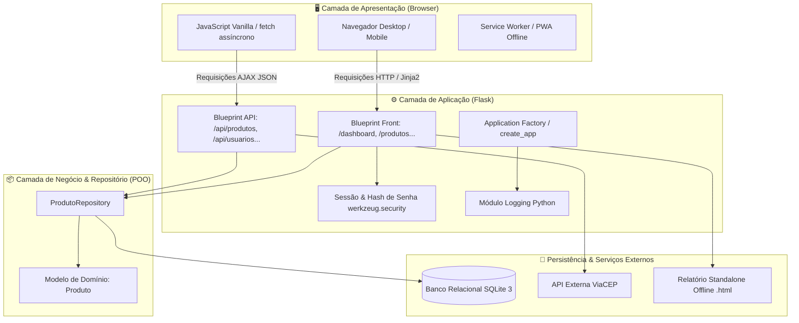

# TechStock — Gestão Inteligente de Estoque WMS

O **TechStock** é uma aplicação web completa desenvolvida como Projeto Integrador do curso Full Stack Python. O sistema substitui o controle manual e planilhas por uma solução organizada, segura, responsiva e de alta usabilidade, permitindo gerenciar produtos de TI, movimentações físicas por ruas/posições, categorias, níveis críticos de estoque e relatórios standalone offline.

---

## 👥 Equipe e Divisão de Responsabilidades

| Integrante | Papel Principal | Fatias de Responsabilidade Desenvolvidas |
|---|---|---|
| **Pâmela Cristina Rodrigues Barbosa** | Banco de Dados & Arquitetura | Modelagem do banco SQLite, `schema.sql`, controle de permissões (Admin/Operador), autenticação com hash seguro, documentação oficial e relatórios. |
| **Thiago Rodrigues** (`Thiago-Navo`) | Front-end & UI/UX | Desenvolvimento visual em HTML semântico, CSS Grid responsivo (PC/Mobile), JS Vanilla com `fetch()` assíncrono, Dark/Light Mode, PWA e GitHub Pages. |
| **Maurício Keiser** (`mauriciokeiser`) | Back-end & Integrações | Camada de rotas da API REST (CRUDs completos), script de povoamento `seed.py` e integração externa com ViaCEP. |

---

## 🏛️ Padrão Arquitetural

O projeto adota uma arquitetura em camadas baseada em **Application Factory**, **Blueprints** modulares e o **Repository Pattern**:

- **Apresentação**: Templates Jinja2 semânticos, CSS Grid responsivo com tema claro/escuro e JavaScript Vanilla.
- **Roteamento & Controle**: Blueprints segregados para páginas web (`front_bp`) e API REST (`api_bp`).
- **Camada de Repositório & Domínio (POO)**: `ProdutoRepository` isola o acesso a dados e utiliza a classe de domínio `Produto` com métodos de validação (`validar()`), cálculo de faixas de estoque (`calcular_status_estoque()`) e formatação monetária.
- **Persistência**: SQLite 3 com integridade referencial ativa (`PRAGMA foreign_keys = ON`), transações atômicas e proteção estrita contra SQL Injection via consultas parametrizadas (`?`).
- **Observabilidade**: Sistema de telemetria configurado com o módulo padrão `logging` do Python em substituição a `print()`.

---

## 📊 Diagrama Didático da Arquitetura e Fluxo de Dados



---

## 🚀 Funcionalidades Principais

- **Autenticação & Controle de Acesso (RBAC)**: Login/Logout com sessão segura, senhas criptografadas com hash forte (`scrypt`/`pbkdf2`) e perfis de acesso (`admin` vs `operador`).
- **Gestão Completa de Estoque (CRUD)**: Cadastro de produtos, categorias, fornecedores, ruas físicas e posições.
- **Movimentações Físicas**: Registro de transferências entre ruas com validação atômica de saldo e rastreabilidade por usuário.
- **Dashboard com Indicadores em Tempo Real**: KPIs de produtos cadastrados, itens em estoque crítico/atenção e volume de movimentações.
- **Consumo de API Externa (ViaCEP)**: Consulta em tempo real de logradouro, bairro, cidade e UF sem recarregar a tela.
- **Exportação Standalone Offline**: Endpoint `/exportar-relatorio` que gera um arquivo `.html` autocontido com dados e JavaScript embutidos para busca e filtro 100% offline.
- **PWA (Progressive Web App)**: Instalável no computador ou smartphone através de manifesto (`manifest.json`) e Service Worker com suporte a cache.

---

## 🛠️ Tecnologias Utilizadas

- **Linguagem**: Python 3.10+
- **Framework Web**: Flask 3.x
- **Servidor WSGI**: Gunicorn (produção / Docker)
- **Banco de Dados**: SQLite 3 (com Foreign Keys ativas)
- **Segurança**: Werkzeug Security (`generate_password_hash` / `check_password_hash`)
- **Frontend**: HTML5 Semântico, CSS Grid & Flexbox, JavaScript Vanilla, Bootstrap Icons
- **Testes Automatizados**: Pytest 8.x
- **Containerização**: Docker e Docker Compose

---

## 💻 Instalação e Execução

### Opção 1: Execução Local com Python e Virtualenv

1. **Clone o repositório:**
   ```bash
   git clone https://github.com/Thiago-Navo/Pr--Trabalho-Trabalho-Final.git
   cd Pr--Trabalho-Trabalho-Final
   ```

2. **Crie e ative o ambiente virtual:**
   - **Windows:**
     ```powershell
     python -m venv .venv
     .venv\Scripts\activate
     ```
   - **Linux / macOS:**
     ```bash
     python3 -m venv .venv
     source .venv/bin/activate
     ```

3. **Instale as dependências:**
   ```bash
   pip install -r requirements.txt
   ```

4. **Inicialize e popule o banco de dados (duas formas disponíveis):**
   ```bash
   # Via script direto na raiz:
   python seed.py

   # Ou via comando Flask CLI:
   flask --app app init-db
   ```

5. **Inicie o servidor de desenvolvimento:**
   ```bash
   python run.py
   ```
   Acesse a aplicação no navegador em: **`http://127.0.0.1:5001`**

---

### Opção 2: Execução com Docker e Docker Compose (Bônus)

Para subir o sistema containerizado com um único comando sem precisar configurar Python localmente:

```bash
docker compose up --build
```

Acesse em: **`http://localhost:5001`**

---

## 🔑 Credenciais para Avaliação

O script de povoamento (`seed.py`) disponibiliza dois perfis prontos para teste:

| Perfil | Usuário | Senha | Nível de Acesso |
|---|---|---|---|
| **Administrador** | `admin` | `admin123` | Acesso total (criação de usuários, edição, exclusão e movimentações). |
| **Operador** | `pamela` | `admin123` | Operação do dia a dia (consulta, cadastro de produtos e movimentações). |

---

## 🧪 Testes Automatizados

O projeto conta com **21 testes unitários e de integração** cobrindo regras de negócio, POO, hashing de senhas, rotas protegidas, consultas e integridade do banco:

```bash
# Executar a suíte completa com pytest:
pytest

# Ou modo detalhado:
pytest -v
```

---

## 🌐 GitHub Pages

A página estática informativa para portfólio está disponível no link oficial:  
👉 **[https://thiago-navo.github.io/Pr--Trabalho-Trabalho-Final/](https://thiago-navo.github.io/Pr--Trabalho-Trabalho-Final/)**
